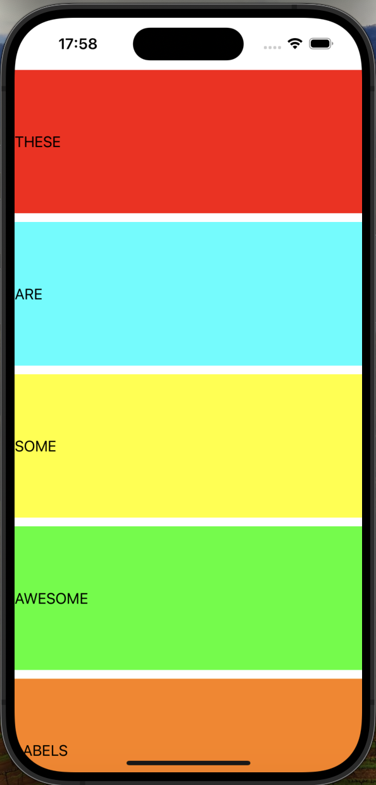

# Project6

Project6 is a simple iOS app that displays a series of colorful labels on the screen.

## Features

* Displays a set of labels with different colors and text
* Labels are arranged vertically and take up a fixed percentage of the screen's height
* Each label is positioned 10 points below the previous one

## Screenshots

  
   
  <em>Project6 Labels Screen</em>

## Code Overview

The project consists of a single `ViewController` class that manages the layout of the labels. The labels are created and added to the view programmatically, and their layout is defined using Auto Layout constraints.

### ViewController

* Creates and adds a set of labels to the view
* Defines the layout of the labels using Auto Layout constraints
* Uses the `translatesAutoresizingMaskIntoConstraints` property to disable automatic layout constraints for each label
* Uses the `sizeToFit()` method to ensure each label takes up as much space as needed
